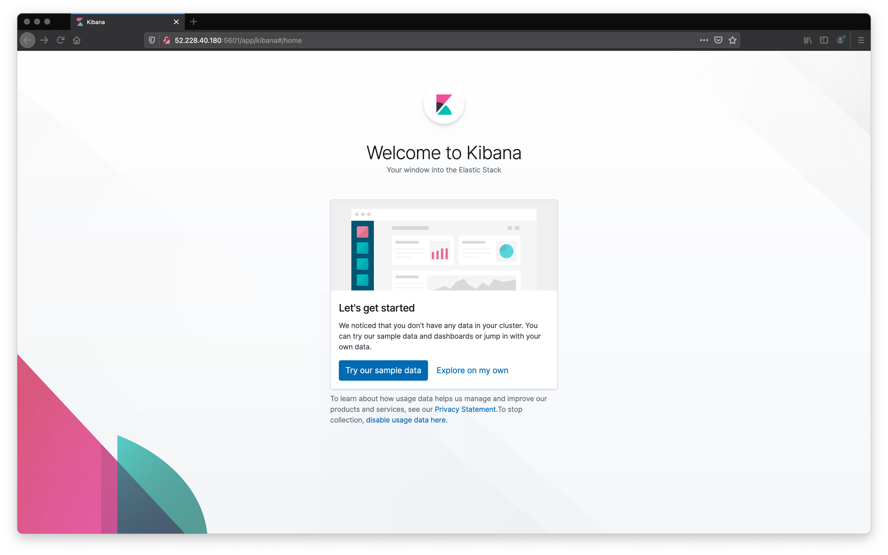

# elk_stack

## Automated ELK Stack Deployment

The files in this repository were used to configure the network depicted below.

[diagram]: images/network_diagram.png

These files have been tested and used to generate a live ELK deployment on Azure. They can be used to either recreate the entire deployment pictured above. Alternatively, selecting certain ansible-playbooks of the project may be used to install only certain pieces of it, such as Filebeat.

This document contains the following details:
- Description of the Topologu
- Access Policies
- ELK Configuration
  - Beats in Use
  - Machines Being Monitored
- How to Use the Ansible Build

### Description of the Topology

The main purpose of this network is to expose a load-balanced and monitored instance of DVWA, the D*mn Vulnerable Web Application.

Load balancing ensures that the application will be highly available and reliable, in addition to restricting the webservers to the network.

This allows the us to control the traffic incoming to the webservers. If one webserver goes down, we can move the traffic to the remaining webservers. During this time, we can fix the issues on the servers that have gone down. It also helps to defend against Denial of Service attacks.

The advantage of the Jump-Box is that it helps to minimize the attack surface of the network. The Jump-Box is the virtual machine that is responsible for configuring the network, which allows the option to bring new virtual machines online and maintains servers. The Jump-Box is the brains of the operation. However, it is a double-edged sword. On one hand it minizes the attack surface, meanwhile, on the other hand, there is a single point of failure: if you own the Jump-Box, you own the network.

Note: In this situation we have installed docker on the Jump-Box, and you can only manipulate the other virtual machines on the network as added security via the docker container.

Integrating an ELK server allows users to easily monitor the vulnerable VMs for changes to the log files and system metrics.

I have utilized Filebeat and Metricbeat to help understand what is on happening on the network.

Filebeat watches for changes to log files, in which you specify (syslog, ssh logins, sudo commands, new users and groups, etc.). When it notices a change to log files, it sends the new log data to libbeat. libbeat then sends the data to the specified output such as elasticsearch or logstash.

Metricbeat records system metrics, such as CPU usage, memory, storage devices, and network interfaces usage.

The configuration details of each machine may be found below.

| Name     | Function | IP Address | Operating System |
|----------|----------|------------|------------------|
| Jump-Box | Gateway  | 10.0.1.4   | Ubuntu           |
| Web-1    | DVWA     | 10.0.1.5   | Ubuntu           |
| Web-2    | DVWA     | 10.0.1.6   | Ubuntu           |
| Web-3    | DVWA     | 10.0.1.7   | Ubuntu           |
| ELK      | ELK      | 10.1.0.4   | Ubuntu           |

### Access Policies

The machines on the internal network are not exposed to the public internet. 

Only the Jump-Box, ELK kibana dashboard, and tebrugge-LB (load balancer) can accept connections from the internet. Access to the Jump-Box, ELK kibana dashboard, and tebrugge-LB is only accessible from the following IP addresses: My Public IP

In order to access the DVWA, you need to use My Public IP address and connect to the Load Balancer public IP address: 40.88.15.140 on port 80 (http).

You can also access the kibana dashboard again using My Public IP address. Open a web browser and use the ELK public IP address: 52.228.40.180 on port 5601 (kibana) - [http://52.228.40.180:5601/app/kibana]

Machines within the network can only be accessed via the Jump-Box.

The ELK virtual machine can only accessed by the docker container, which is located on the Jump-Box (10.0.1.4)

A summary of the access policies in place can be found in the table below.

| Name        | Publicly Accessible | Allowed IP Addresses  | Allowed Ports (TCP)                                  |
|-------------|---------------------|-----------------------|------------------------------------------------------|
| Jump-Box    | Yes                 | My Public IP          | 22 (ssh)                                             |
| tebrugge-LB | Yes                 | My Public IP          | 80 (http)                                            |
| Web-1       | No                  | 10.0.1.4              | 22 (ssh)                                             |
| Web-2       | No                  | 10.0.1.4              | 22 (ssh)                                             |
| Web-3       | No                  | 10.0.1.4              | 22 (ssh)                                             |
| ELK         | Yes                 | My Public IP/10.0.1.4 | 5044 (logstash) 5601 (kibabna), 9200 (elasticsearch) |

### Elk Configuration

Ansible was used to automate configuration of the ELK machine. The advantage of automating configuration with ansible is that it helps to ensure availability. This means less down time when bringing up servers, server maintenance can dramatically reduce the time in which a company can implement development environments. What once could have taken months can now be done in a fews weeks or even less.

The playbook implements the following tasks:

- install docker.io
- install python3-pip
- install Docker module
- increase virtual memory of ELK VM
- ensure memory maps have been increased
- download and launch a docker elk container

The following screenshot displays the result of running `docker ps` after successfully configuring the ELK instance.
 

### Target Machines & Beats
This ELK server is configured to monitor the following machines:

- Web-1 : 10.0.1.5
- Web-2 : 10.0.1.6
- Web-3 : 10.0.1.7

We have installed the following Beats on these machines:

- Web-1 : 10.0.1.5 - Filebeat and Metricbeat
- Web-2 : 10.0.1.6 - Filebeat and Metricbeat
- Web-3 : 10.0.1.7 - Filebeat and Metricbeat

These Beats allow us to collect the following information from each machine:

Filebeat watches for changes to log files, in which you specify (syslog, ssh logins, sudo commands, new users and groups, etc.). When it notices a change to log files, it sends the new log data to libbeat. libbeat then sends the data to the specified output such as elasticsearch or logstash.

- ssh logins: this show when a ssh connection is made to the webservers, for example when maintence is performed on a server. 

Metricbeat records system metrics such as CPU usage, memory, storage devices, and network interfaces usage.

- network interfaces: this will show statics about traffic, for example how many connections to the server came from x country.

### Using the Playbook
In order to use the playbook, you will need to have an Ansible control node already configured. Assuming you have such a control node provisioned. 

SSH into the control node and follow the steps below:

- Copy the ansible-playbooks to /etc/ansible/
	
	install-elk.yml 
	filebeat-playbook.yml
	metricbeat-playbook.yml 
	webservers-playbook.yml
	
- While in the /etc/ansible make a directory called 'files'

	cd /etc/ansible/
	
	mkdir files

- Copy the configuration files to /etc/ansible/files/ 

	filebeat-config.yml
	metricbeat-config.yml
	
- Update the Filebeat and Metricbeat config.yml

	filebeat-config.yml - update these fields below to the ELK private IP address
	
	line 1105 - hosts: ["10.1.0.4:9200"]
	
	line 1805 - host: "10.1.0.4:5601"
	
	metricbeat-config.yml - 
	
	line 62 - host: "10.1.0.4:5601"
	
	line 96 - hosts: ["10.1.0.4:9200"]
	
- Update ansible.cfg located in /etc/ansible/ to username that runs the ansible-playbooks

	line 107 - remote_user = tebrugge

- Update the hosts file in /etc/ansible to include:

	[webservers]
	10.0.1.5 ansible_python_interpreter=/usr/bin/python3
	10.0.1.6 ansible_python_interpreter=/usr/bin/python3
	10.0.1.7 ansible_python_interpreter=/usr/bin/python3

	[elk]
	10.1.0.4 ansible_python_interpreter=/usr/bin/python3
	
- Run a ping test on webservers and elk
	
	ansible webservers -m ping
	
	ansible elk -m ping
	
	- in both cases you are looking for green text referencing ping - pong. This means you will reach the servers when running the ansible-playbooks.
	
- Run the ansibe-playbooks in this order - install-elk.yml, filebeat-playbook.yml, and metricbeat-playbook.yml - from /etc/ansible

	#this will be installed on ELK
	ansible-playbook install-elk.yml
	
	#this will be installed on webservers
	ansible-playbook filebeat-playbook.yml
	
	#this will be installed on webservers
	ansible-playbook metricbeat-playbook.yml
	
- Wait about 2-5 minutes for kibana to start up.
	
- Using your browser, go to http://52.228.40.180:5601/app/kibana to verify that the installation is running as expected. You should see the kibana dashboard as seen below.

- Once everything is working - you can now decide if you want your Filebeat and Metricbeat to start manually or to enable them on systemd to start up when the virtual machines are booted up. The choice is yours.

  Option 1 - filebeat-metricbeat-manual-start.yml

  Option 2 - filebeat-metricbeat-enable-reboot.yml

    and

  Option 3 - filebeat-metricbeat-disable-reboot.yml

- I have also included the webservers-playbook.yml in the event you need to restore the DVWA containers to their original state. Once you run the webservers-playbook.yml, you will have to run filebeat-playbook.yml and metricbeat-playbook.yml again.
